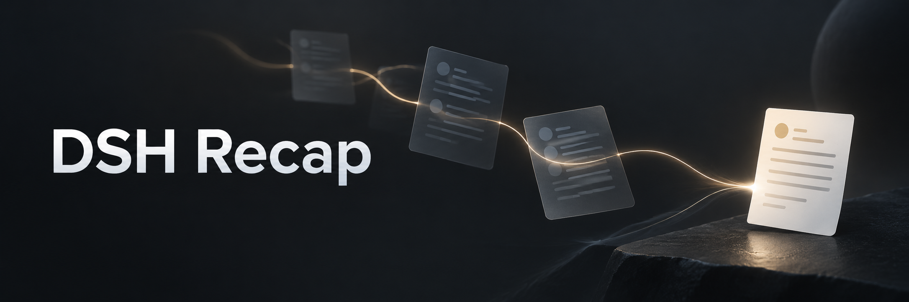
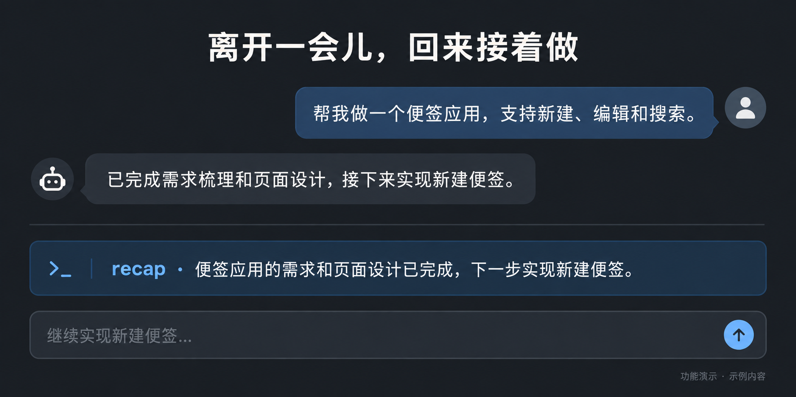
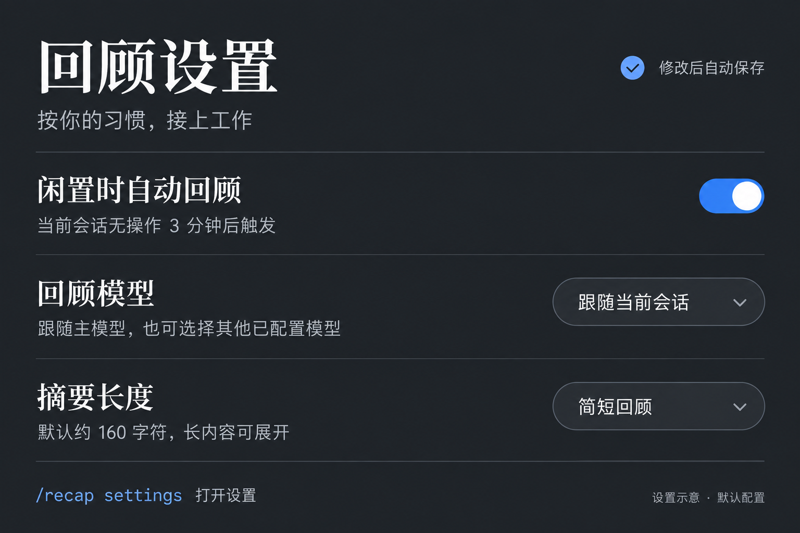

<p align="center">
  
</p>

# DSH Recap

**Pick up where you left off.** A short recap of what you are working on, what is done, and what comes next — right inside DeepSeek Harness.

[简体中文](README.zh-CN.md) · [Quick start](#quick-start) · [Commands](#commands) · [Configuration](docs/配置说明.md) · [Report an issue](https://github.com/lolipop-1x1/dsh-recap/issues)


[](LICENSE)

## A small reminder, right where you work

Returning to a long conversation should not mean rereading every message. Run `/recap` to get a brief summary of the current task and its progress.



_Illustrative demo with fictional content, shown in Chinese._

- **On demand or while idle.** Request a recap yourself, or let it appear after three minutes without activity in the visible session.
- **Brief, with room to expand.** About 160 characters by default, with a three-line preview and an expand control for longer results.
- **Your choice of model.** Follow the conversation model or select another configured model to control cost.
- **Keep working.** Generation runs in the background. Repeated requests share work; a failure preserves the previous recap and offers a retry.

## Quick start

### 1. Install from GitHub

Open **Plugins** in the Harness sidebar, click **Add plugin**, and paste this URL into the package name or address field:

```text
https://github.com/lolipop-1x1/dsh-recap
```

Click **Install**. If build-script approval is requested, review the source and listed scripts, then allow them and retry; GitHub installation builds the plugin from source.

After installation, restart Harness if prompted, then refresh the browser. If another plugin already owns `/recap`, disable that plugin first.

### 2. Get your first recap

Open a conversation with some work in it and send:

```text
/recap
```

To choose a model or adjust automatic recaps, send `/recap settings` or open **Settings → Recap**. Changes save automatically.

## Commands

| Command           | What it does                                                                       |
| ----------------- | ---------------------------------------------------------------------------------- |
| `/recap`          | Generate a recap, or reuse an unchanged result.                                    |
| `/recap refresh`  | Generate again, bypassing the cache.                                               |
| `/recap hide`     | Hide the recap and pause automatic recaps for this session until a manual request. |
| `/recap status`   | Show status without generating or revealing a hidden recap.                        |
| `/recap settings` | Open the recap settings dialog directly.                                           |
| `/recap help`     | Show command help.                                                                 |

The submitted command clears immediately while generation continues. A new draft you type is left alone. Manual recaps appear at their command position; opening settings or checking status does not move them.

## Make it yours

Open `/recap settings` to adjust triggers without leaving the conversation. Edits save automatically.



_Illustrated settings overview; defaults and generation budgets are listed below._

| Setting           | Default                                                                     |
| ----------------- | --------------------------------------------------------------------------- |
| Recap model       | Follow the current conversation; optionally choose another configured model |
| Language          | Follow the interface, or choose Chinese / English                           |
| Automatic recap   | After 3 minutes idle, once 3 meaningful turns have completed                |
| Target length     | About 160 characters, preserving complete sentences                         |
| Generation budget | Up to 12 recent messages, 6,000 source characters and 512 output tokens     |

These budgets limit input material and output; they are not a fixed per-request charge. Advanced options are collapsed in settings. See the [configuration reference](docs/配置说明.md) for all fields and legacy compatibility.

Opening or switching sessions does not immediately generate a recap. Keyboard, pointer and scroll activity reset the idle timer; generation waits until the main agent is idle. Completed recaps stay visible when the page loses focus. Continuing the conversation, refreshing or closing the page hides them. Refreshing one tab does not clear another tab's recap.

## Further reading

- [Configuration reference](docs/配置说明.md) — defaults, limits and compatibility
- [Design](docs/设计文档.md) — behavior and scope
- [Validation notes](docs/验证说明.md) — automated coverage, live Harness checks and remaining gaps
- [Changelog](CHANGELOG.md) — changes

Live checks have covered model generation, direct settings dialogs, timeout/retry and per-tab refresh behavior. Fresh-profile installation, long-running behavior and other providers are not fully verified. Detailed project documentation is currently in Chinese.

## License

[MIT](LICENSE).
